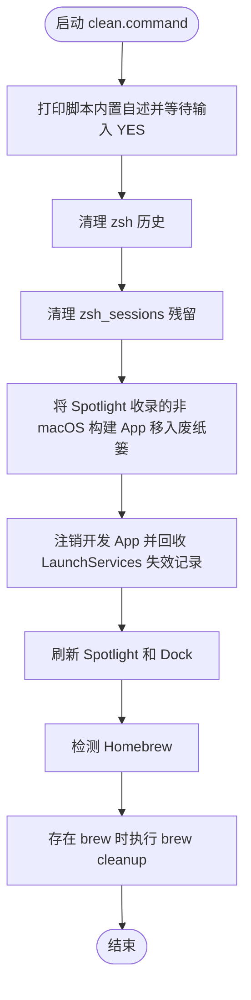

# `clean.command`


[toc]

---

## 🔥 <font id=前言>前言</font>

- 采用 Shell 脚本的原因：Shell 来自 [**macOS**](https://www.apple.com/macos/) 原生系统底层，虽然写法相对繁琐冗杂，但执行效率高，并且不需要额外介入 [**Ruby**](https://www.ruby-lang.org)、[**Python**](https://www.python.org) 等第三方运行环境，因此具备更好的移植性。

## 一、功能 <a href="#前言" style="font-size:17px; color:green;"><b>🔼</b></a> <a href="#🔚" style="font-size:17px; color:green;"><b>🔽</b></a>

该脚本会连续完成四类清理：

- 清空 zsh 历史和 `zsh_sessions` 残留。

- 将 Spotlight 已收录的 iPhone、Apple TV、Apple Watch 和 Apple Vision 构建 App 移入废纸篓，从文件源头清理带禁止标记、无法在 [**macOS**](https://www.apple.com/macos/) 打开的图标。

- 定向注销 `LaunchServices` 中的非 macOS 构建 App 和 iOS Simulator App 记录。

- 检测到 [**Homebrew**](https://brew.sh/) 时执行 `brew cleanup`。

如果当前 Homebrew 开启 tap trust 策略，脚本会在清理前自动信任已安装的 `leoafarias/fvm` tap，避免 `brew cleanup` 反复输出 `Skipping fvm: tap formula is not trusted` 警告。

该脚本适合 `.command` 双击运行，也可以在终端中执行。启动后的说明展示、依赖检查和核心流程都写在脚本内部。

## 二、运行

```zsh
./clean.command
```

如果已经自行加入 `PATH`，也可以执行：

```zsh
clean
clean [参数...]
```

脚本会清空终端历史并移动构建产物，因此必须输入完整的 `YES` 才会继续；其它输入一律取消。

## 三、结构约定

运行时说明和核心流程已经写在 `clean.command` 内部，不依赖同级 `README.md`。

本 README 只用于源码浏览、维护说明和当前流程说明。

## 四、失效 App 图标清理边界

- 只移动 Spotlight 已收录、位于当前用户目录内、且路径符合 Xcode `Build/Products` / `build` 输出特征的 iPhone、Apple TV、Apple Watch 和 Apple Vision `.app`。

- 构建 App 不直接删除，而是按原绝对路径结构移入废纸篓中的 `JobsClean-DevelopmentApps-*` 目录，可手动恢复；也可以通过 Xcode / Flutter 重新构建。

- `CoreSimulator` 设备容器中的 App 只注销 `LaunchServices` 记录，不移动实体；`Applications` 里的正常 App 始终排除。

- 完成后会短暂重启 `Spotlight`、`corespotlightd`、`sharedfilelistd` 和 `Dock`，图标列表会重新加载，Dock 可能闪烁一次。

- 后续重新运行 Xcode 或 Simulator 时，开发 App 可能被系统再次登记；再次执行 `clean` 即可清理。

## 五、流程图



## 六、日志文件

运行日志默认写入 `$TMPDIR`，文件名通常来自脚本名去掉扩展名：

```shell
$TMPDIR/clean.log
```

## 七、风险说明

- zsh 历史会被清空，无法从脚本自动恢复。

- 非 macOS 构建 `.app` 会离开原构建目录；它们属于可重新生成的构建产物，可从废纸篓恢复或重新构建。

- LaunchServices 只注销符合开发输出路径特征的非 macOS App，不使用全局 `-kill` 重建，避免扰动正常 App 的打开方式关联。

<a id="🔚" href="#前言" style="font-size:17px; color:green; font-weight:bold;">我是有底线的➤点我回到首页</a>
