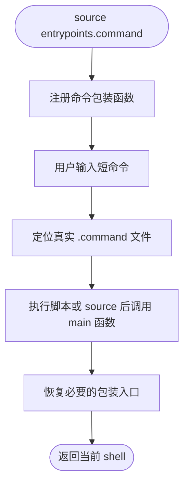

# entrypoints.command


[toc]

## 🔥 <font id=前言>前言</font>

- 采用 Shell 脚本的原因：Shell 来自 [**macOS**](https://www.apple.com/macos/) 原生系统底层，虽然写法相对繁琐冗杂，但执行效率高，并且不需要额外介入 [**Ruby**](https://www.ruby-lang.org)、[**Python**](https://www.python.org) 等第三方运行环境，因此具备更好的移植性。


## 一、功能 <a href="#前言" style="font-size:17px; color:green;"><b>🔼</b></a> <a href="#🔚" style="font-size:17px; color:green;"><b>🔽</b></a>

注册终端短命令包装器。真实命令实现统一位于 `Scripts/<命令>.command/<命令>.command`。

该文件主要作为 JobsMacEnv 的 shell 函数模块 / 入口注册模块使用，通常由 shell 配置或上层脚本 `source` 加载。

## 二、运行 <a href="#前言" style="font-size:17px; color:green;"><b>🔼</b></a> <a href="#🔚" style="font-size:17px; color:green;"><b>🔽</b></a>

```zsh
source Scripts/entrypoints.command/entrypoints.command
```

## 三、功能清单 <a href="#前言" style="font-size:17px; color:green;"><b>🔼</b></a> <a href="#🔚" style="font-size:17px; color:green;"><b>🔽</b></a>

当前注册的终端入口如下：

```text
list
m5c
flat
trs
gif
simios
pods
clean
df
cor
decode
ts
download
to
mp4
mov
webm
mkv
avi
m4v
mp3
m4a
aac
wav
flac
ogg
opus
install
update
shell
zz
x
save
rb
a
b
i
fixfvm
check1
check
c
d
buildCheck
apk
ipa
config
```

## 四、交互规则 <a href="#前言" style="font-size:17px; color:green;"><b>🔼</b></a> <a href="#🔚" style="font-size:17px; color:green;"><b>🔽</b></a>

该文件主要被 shell 配置 source 加载，不是普通一次性执行脚本。它只负责注册入口函数，不承载真实业务实现。
`mp4` / `mov` / `webm` / `mp3` 等媒体格式短命令不单独维护脚本，统一复用 `Scripts/to.command/to.command`。`gif` 已作为录制入口保留；需要转换 GIF 时使用 `to gif 文件`。


## 五、结构约定 <a href="#前言" style="font-size:17px; color:green;"><b>🔼</b></a> <a href="#🔚" style="font-size:17px; color:green;"><b>🔽</b></a>

该文件位于 `Scripts/entrypoints.command/entrypoints.command`。

同级 `README.md` 只用于源码浏览、维护说明和当前流程说明，不参与运行时加载。

## 六、流程图 <a href="#前言" style="font-size:17px; color:green;"><b>🔼</b></a> <a href="#🔚" style="font-size:17px; color:green;"><b>🔽</b></a>



## 七、日志文件 <a href="#前言" style="font-size:17px; color:green;"><b>🔼</b></a> <a href="#🔚" style="font-size:17px; color:green;"><b>🔽</b></a>

运行日志默认写入 `$TMPDIR`，文件名通常来自脚本名去掉扩展名：

```shell
$TMPDIR/entrypoints.log
```

<a id="🔚" href="#前言" style="font-size:17px; color:green; font-weight:bold;">我是有底线的➤点我回到首页</a>
